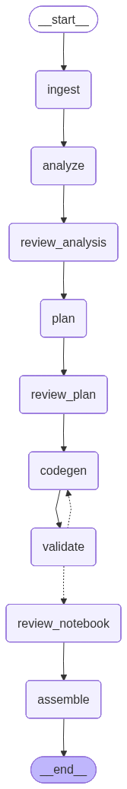

# Paper to Notebook

Turn an arXiv paper or a local PDF into a runnable Jupyter notebook. The project uses a LangGraph workflow to extract paper text, ask an LLM to analyze and plan an implementation, generate notebook cells, execute the generated code for validation, and save the result as an `.ipynb` file.

The prototype is designed for ML papers. It includes human review points so you can inspect the paper analysis, notebook outline, and generated cells before the notebook is written.

## Workflow



The workflow is built in [graph/builder.py](graph/builder.py):

1. **Ingest** — accepts an arXiv ID/URL or a local PDF. arXiv PDFs are downloaded to `outputs/`; PyMuPDF extracts their text.
2. **Analyze** — an LLM converts the paper into structured JSON: contribution, algorithm steps, equations, required PyTorch components, and estimated complexity.
3. **Review analysis** — pause for a human approval or feedback.
4. **Plan** — an LLM proposes 10–14 markdown/code notebook cells for `toy` or `full` scope.
5. **Review plan** — choose scope and approve the notebook outline.
6. **Generate** — an LLM produces runnable Python and explanatory Markdown for every planned cell.
7. **Validate** — code cells are executed in order in a shared namespace. Failed validation feeds the traceback into a regeneration attempt, up to the configured retry limit.
8. **Review notebook and assemble** — review the generated cell list, then write a standards-compliant `.ipynb` file.

## Requirements

- Python 3.10 or newer (the repository currently pins Python 3.12 via `.python-version`)
- [uv](https://docs.astral.sh/uv/), or a compatible Python environment
- One configured LLM provider:
  - Ollama (the default)
  - Anthropic
  - OpenAI
  - Google Gemini
  - OpenRouter

## Install

```powershell
git clone https://github.com/princ0301/paper2nb
cd paper2nb
uv sync
```

Create a `.env` file in the project root. Only configure the provider you intend to use:

```dotenv
# Choose: ollama, anthropic, openai, google, or openrouter
LLM_PROVIDER=ollama

# Ollama (default)
OLLAMA_MODEL=qwen3-coder:480b-cloud
OLLAMA_BASE_URL=http://localhost:11434

# Or configure a hosted provider
# ANTHROPIC_API_KEY=...
# ANTHROPIC_MODEL=claude-sonnet-4-6
# OPENAI_API_KEY=...
# OPENAI_MODEL=gpt-4o
# GOOGLE_API_KEY=...
# GOOGLE_MODEL=gemini-2.0-flash
# OPENROUTER_API_KEY=...
# OPENROUTER_MODEL=anthropic/claude-3.5-sonnet

MAX_VALIDATION_RETRIES=3
OUTPUT_DIR=./outputs
```

Never commit `.env`; it is already ignored by Git.

## Use the CLI

List providers and see which one is active:

```powershell
uv run python cli.py providers
uv run python cli.py config
```

Generate a notebook from an arXiv identifier, an arXiv URL, or a local PDF:

```powershell
uv run python cli.py run 1412.6980
uv run python cli.py run https://arxiv.org/abs/1706.03762
uv run python cli.py run C:\papers\my-paper.pdf
```

During execution, answer the three terminal prompts:

- approve or comment on the paper analysis;
- choose `toy` (small, CPU-friendly) or `full` scope and approve the cell plan;
- approve or comment on the generated notebook.

Generated PDFs and notebooks are saved under `outputs/`. For example, this repository includes [the original Adam paper PDF](outputs/1412.6980.pdf) and [a generated notebook](outputs/1412.6980.ipynb).

## Display or regenerate the workflow image

In Jupyter, display the compiled LangGraph directly:

```python
from workflow import display_workflow

display_workflow()
```

To create the PNG embedded above:

```powershell
uv run python workflow.py --output outputs/workflow.png
```

`workflow.py` renders the graph from the live workflow definition, so the visual stays aligned with `graph/builder.py`.

## What a generated notebook looks like

The checked-in example was generated from **arXiv:1412.6980 — Adam: A Method for Stochastic Optimization**. It has 11 cells that install/import dependencies, define a toy optimization problem, implement the optimizer concepts, train it, plot the loss, compare it with PyTorch Adam, and summarize the result.

For example, the notebook defines a deliberately small CPU-friendly objective before introducing the optimizer:

```python
# Define a simple quadratic loss function: L(x) = (x - 3)^2
# Minimum is at x = 3

class QuadraticLoss(nn.Module):
    def __init__(self):
        super(QuadraticLoss, self).__init__()

    def forward(self, x):
        return (x - 3) ** 2

loss_fn = QuadraticLoss()
```

The generator is instructed to create complete code cells, explain equations in Markdown, use small dimensions for `toy` scope, and save plots rather than calling `plt.show()`.

## Project layout

```text
paper-to-notebook/
├── cli.py                 # Typer CLI
├── workflow.py            # IPython display and PNG renderer for the graph
├── config/settings.py     # .env-backed configuration
├── providers/factory.py   # LLM provider selection
├── graph/
│   ├── builder.py         # LangGraph nodes, edges, retry routing
│   ├── state.py           # Shared workflow state
│   └── nodes/             # Ingest, LLM, HITL, validation, assembly stages
├── prompts/               # JSON-only LLM prompt templates
├── utils/                 # arXiv download, PDF extraction, JSON parsing
└── outputs/               # Downloaded papers, generated notebooks, workflow PNG
```

## Development notes

- Run a syntax check with `uv run python -m compileall config graph hitl providers utils main.py cli.py workflow.py`.
- The legacy [main.py](main.py) runs a fixed Adam-paper example; prefer `cli.py` for normal use.
- Validation executes LLM-generated Python with `exec()` in the current process. Treat generated notebooks as code that needs review; do not use this prototype with untrusted inputs in a sensitive environment.

